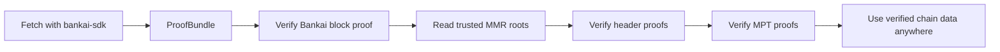

# Bankai SDK

Trustless access to on-chain data through proof bundles you can verify anywhere.

Bankai gives you a simple flow:

1. fetch the chain data you want with `bankai-sdk`
2. verify the returned `ProofBundle` with `bankai-verify`
3. use the verified headers, accounts, storage, transactions, or receipts in your app or zk system

## Why Bankai

Bankai is built around stateless light clients.

Bankai syncs its light clients fully offchain and gives you a proof over that state.

That means you can verify chain data anywhere without deploying or syncing a light client where you want to use it.

The proof bundle contains:

- a Bankai block proof
- the relevant MMR roots
- header inclusion proofs
- MPT proofs for accounts, storage, transactions, or receipts

The verifier checks the proof and the Bankai block hash. If you pin a specific Bankai deployment or release, you should also check that the block's `program_hash` matches the program you expect.

## The Main Crates

| Crate | What it is for |
| --- | --- |
| `bankai-sdk` | The main entrypoint. Configure RPCs, fetch Bankai API data, and assemble optimized proof bundles. |
| `bankai-verify` | Verify proof bundles step by step and return trusted results. |
| `bankai-types` | Shared input, output, and API types used by the SDK and verifier. |

`bankai-core` and `mpt-generate` power lower-level proof construction internally, but most users should start with `bankai-sdk` and `bankai-verify`.

## Quickstart

```rust
use alloy_primitives::Address;
use bankai_sdk::{Bankai, HashingFunction, Network};
use bankai_verify::verify_batch_proof;

#[tokio::main]
async fn main() -> Result<(), Box<dyn std::error::Error>> {
    let bankai = Bankai::new(
        Network::Sepolia,
        Some("https://sepolia.infura.io/v3/YOUR_KEY".to_string()),
        Some("https://sepolia.beacon-api.example.com".to_string()),
        None,
    );

    let proof_bundle = bankai
        .init_batch(Network::Sepolia, None, HashingFunction::Keccak)
        .await?
        .ethereum_execution_header(9_231_247)
        .ethereum_account(9_231_247, Address::ZERO)
        .execute()
        .await?;

    let results = verify_batch_proof(proof_bundle)?;

    println!(
        "Verified execution block {}",
        results.evm.execution_header[0].number
    );
    println!(
        "Verified account balance {}",
        results.evm.account[0].balance
    );

    Ok(())
}
```

If you want the guided version of this flow, start with [Getting Started](docs/getting-started.md).

## Trust Flow



At a high level:

- the block proof gives you a verified Bankai block
- that block contains the roots or commitments needed for the next step
- the MMR proof gives you the target header
- the MPT proof gives you the target account, storage slot, transaction, or receipt

## Supported Surfaces

Bankai currently exposes two proof families:

| Surface | What you can verify |
| --- | --- |
| Ethereum | Beacon headers, execution headers, accounts, storage, transactions, receipts |
| OP Stack | Headers, accounts, storage, transactions, receipts for supported OP chains exposed by the Bankai API |

Selectors and low-level APIs also expose:

- Bankai block selectors: `latest`, `justified`, `finalized`, or an explicit Bankai block number
- low-level namespaces: `blocks`, `chains`, `health`, `stats`, `ethereum`, `op_stack`
- chain discovery through the Bankai API instead of a fixed list in the crate

For the full matrix, see [Supported Surfaces](docs/supported-surfaces.md).

## Where To Go Next

### Start Here

- [Getting Started](docs/getting-started.md)
- [Proof Bundles](docs/proof-bundles.md)
- [Verify Crate Guide](docs/verify.md)

### Understand The System

- [Bankai Blocks](docs/concepts-bankai-blocks.md)
- [Ethereum Light Clients](docs/concepts-ethereum-light-clients.md)
- [OP Stack Concepts](docs/concepts-op-stack.md)

### Use The Raw API

- [API Client Overview](docs/api-client.md)

### Walk Through Examples

- [Basic Bundle Example](example/basic-bundle/README.md)
- [Basic API Example](example/basic-api/README.md)
- [World ID Root Example](example/worldid-root/README.md)
- [World ID Replicator Placeholder](example/worldid-replicator/README.md)

## Setup Notes

Add the crates and the required `ethereum_hashing` patch:

```toml
[dependencies]
bankai-sdk = "0.1"
bankai-verify = "0.1"
bankai-types = "0.1"
ethereum_hashing = { git = "https://github.com/bankaixyz/ethereum_hashing", rev = "c457c3e927cc146d7bc91e944cf6d9c55b05d45e", default-features = false, features = ["portable"] }

[patch.crates-io]
ethereum_hashing = { git = "https://github.com/bankaixyz/ethereum_hashing", rev = "c457c3e927cc146d7bc91e944cf6d9c55b05d45e" }
```

`bankai-types` feature flags:

- `results` for verified outputs
- `inputs` for proof bundle and verifier input types
- `api` for raw request and response DTOs

If you are targeting a local Bankai API while still wanting Sepolia Ethereum semantics, prefer `Bankai::new_with_base_url(Network::Sepolia, "http://localhost:8080".to_string(), ...)` instead of switching the whole SDK to `Network::Local`.
