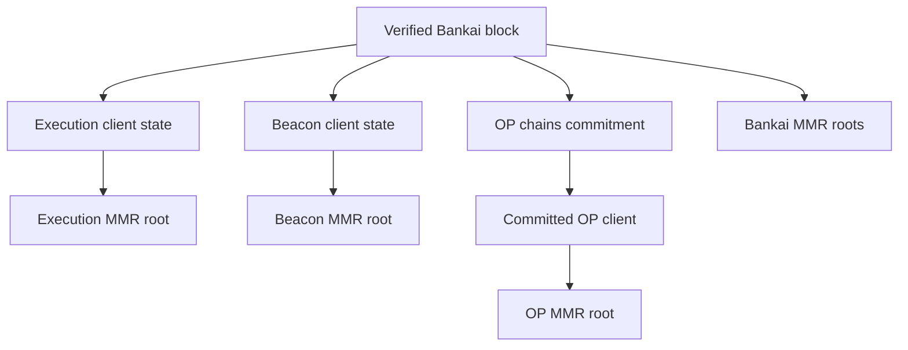

# Bankai Blocks

A Bankai block is the trust anchor for the rest of the verification flow.

Once verified, the roots and commitments inside it are the basis for decommitting headers and on-chain data.

## High-Level Structure

## Important Top-Level Fields

### `version`

The Bankai program version that produced the block.

### `program_hash`

Identifies the proving program behind the block proof.

### `prev_block_hash`

Links this block to the previous Bankai block payload.

### `bankai_mmr_root_keccak` and `bankai_mmr_root_poseidon`

These roots commit the Bankai block sequence itself, not Ethereum or OP headers.

They are used to prove inclusion within Bankai's own block history.

### `block_number`

The sequential Bankai block height.

### `beacon`

The Ethereum beacon-chain view committed by this Bankai block.

### `execution`

The Ethereum execution-chain view committed by this Bankai block.

### `op_chains`

The commitment to the OP Stack chain clients that Bankai has included in this block.

## Beacon Client Fields

The `beacon` section records the beacon-side state committed into this Bankai block:

- `slot_number`: the latest beacon slot represented here
- `header_root`: the beacon header root at that slot
- `state_root`: the beacon state root at that slot
- `justified_height`: latest justified beacon slot
- `finalized_height`: latest finalized beacon slot
- `num_signers`: sync-committee participation summary
- `mmr_root_keccak` / `mmr_root_poseidon`: roots committing beacon headers
- `current_validator_root` and `next_validator_root`: sync-committee transition context

Use it to verify committed beacon headers later.

## Execution Client Fields

The `execution` section records the execution-side state committed into this Bankai block:

- `block_number`: latest committed execution block
- `header_hash`: header hash at that block
- `justified_height`: latest justified execution height
- `finalized_height`: latest finalized execution height
- `mmr_root_keccak` / `mmr_root_poseidon`: roots committing execution headers

Use it to verify execution headers. Once you have a verified header, its state root, transactions root, and receipts root let you verify concrete chain data through MPT proofs.

## OP Chains Commitment

The `op_chains` field contains:

- `root`: the Merkle root committing included OP clients
- `n_clients`: how many OP clients are committed in this Bankai block

This does not directly give you the final OP header.

It gives you the commitment needed to:

1. decommit the relevant OP client
2. read its MMR roots
3. verify the target OP header
4. verify OP account, storage, transaction, or receipt proofs under that header

## Why This Structure Matters

A Bankai block is useful because it turns later checks into local verification steps.

Once verified, it gives you:

- verified Ethereum beacon roots
- verified Ethereum execution roots
- verified commitments to supported OP clients
