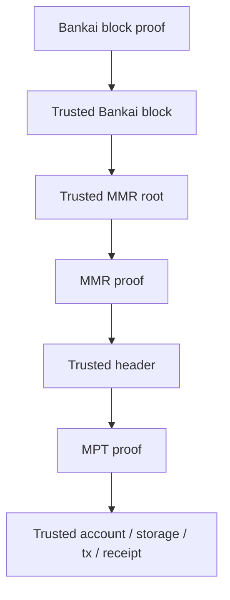

# Proof Bundles

The main goal of `bankai-sdk` is to make proof-bundle construction simple.

You ask for the data you want. The SDK fetches the required Bankai and RPC data, deduplicates shared dependencies, and returns one `ProofBundle` that `bankai-verify` can consume directly.

## What A Proof Bundle Gives You

At a high level, a proof bundle contains:

- a Bankai block proof
- the trusted Bankai block
- Ethereum proofs, when requested
- OP Stack proofs, when requested

After verification, that bundle gives you verified headers and verified EVM objects.

## The Trust Chain

The verification path is always the same:

1. verify the Bankai block proof
2. read the relevant MMR root from the verified Bankai block
3. verify the header proof against that MMR root
4. verify the MPT proof against the trusted header root

For OP Stack chains there is one extra decommitment step:

- the Bankai block commits OP chain clients
- from that commitment you can decommit the OP client output
- then you use the OP client's MMR root to verify the target OP header

## Why Bundles Help

Without a bundle, an application would need to coordinate:

- Bankai block discovery
- block proof fetching
- MMR root selection
- header proof fetching
- MPT proof fetching
- deduplication across multiple requests

The SDK handles that assembly for you.

## Deduplication

Proof bundles avoid unnecessary duplication during construction.

In practice that means:

- requests in the same batch share one Bankai anchor
- repeated dependency proofs do not need to be fetched independently for each request
- you can ask for multiple objects in one flow and still get one verifier input

This keeps the verifier input smaller and makes the same bundle format practical for apps and zk flows.

## What You Can Ask For

### Ethereum

- execution headers
- beacon headers
- accounts
- storage slots
- transactions
- receipts

### OP Stack

- headers
- accounts
- storage slots
- transactions
- receipts

See [Supported Surfaces](supported-surfaces.md) for the exact method list.

## How Tx And Receipt Proofs Are Built

Transaction and receipt proofs are assembled locally from chain RPC data.

The rough flow is:

1. find the target transaction and its block/index
2. fetch the full block transactions or receipts
3. rebuild the ordered trie locally
4. return the proof nodes plus the target payload

This applies to Ethereum execution chains and OP Stack chains. On OP Stack, the proof path uses OP-specific transaction and receipt encoding.

## When To Use The SDK

Use `bankai-sdk` when you want:

- the easiest path to verified data
- one bundle containing everything needed for verification
- shared proof assembly across multiple requests
- a natural bridge into zkVM verification

Use the raw API only when you specifically want direct DTO and endpoint control.

## Next Reads

- [Verify Crate Guide](verify.md)
- [Bankai Blocks](concepts-bankai-blocks.md)
- [Basic Bundle Example](../example/basic-bundle/README.md)
