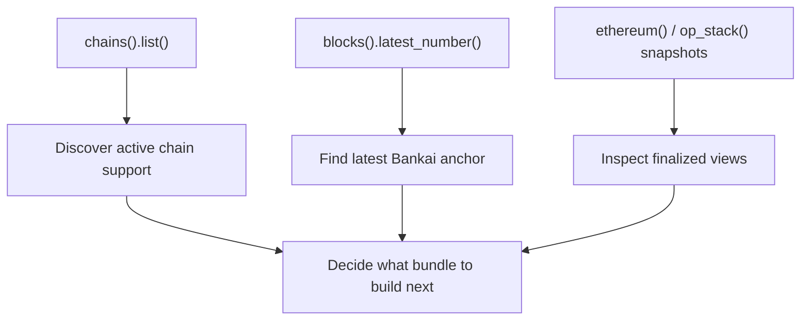

# Basic API Example

This example is for readers who want to inspect the Bankai system directly before they start building proof bundles.

Instead of asking the SDK to assemble everything for you, this flow explores the raw API surface in a useful order.

## Story

Suppose you want to answer three questions before you build anything:

1. what chains does this Bankai API currently expose?
2. what is the latest trusted Bankai anchor I can use?
3. what do the finalized Ethereum and OP snapshots look like right now?

That is a good fit for `sdk.api.*`.

## Visual Flow



## Example

```rust
use bankai_sdk::{Bankai, Network};
use bankai_types::api::ethereum::BankaiBlockFilterDto;

# async fn example() -> Result<(), Box<dyn std::error::Error>> {
let sdk = Bankai::new(Network::Sepolia, None, None, None);
let finalized = BankaiBlockFilterDto::finalized();

let chains = sdk.api.chains().list().await?;
let latest_bankai = sdk.api.blocks().latest_number().await?;
let execution = sdk.api.ethereum().execution().snapshot(&finalized).await?;
let beacon = sdk.api.ethereum().beacon().snapshot(&finalized).await?;
let base = sdk.api.op_stack().snapshot("base", &finalized).await?;

println!("Active integrations: {}", chains.len());
println!("Latest Bankai block: {}", latest_bankai);
println!("Finalized execution height: {}", execution.end_height);
println!("Finalized beacon height: {}", beacon.end_height);
println!("Base finalized height: {}", base.end_height);
# Ok(())
# }
```

## Why This Is Useful

This flow helps you:

- discover support instead of guessing it
- inspect selectors like `finalized` directly
- understand the shape of Bankai snapshots before asking for proofs
- debug or prototype integrations without immediately constructing a `ProofBundle`

## When To Stop Using The Raw API

Once you know what you want, switch back to the batch builder if your end goal is verified application data.

The raw API is best for:

- discovery
- inspection
- debugging
- custom proof request flows

The batch builder is best for:

- production data retrieval
- simpler application logic
- verifier-ready bundle assembly

## Read Next

- [API Client Overview](../../docs/api-client.md)
- [Getting Started](../../docs/getting-started.md)
- [Basic Bundle Example](../basic-bundle/README.md)
