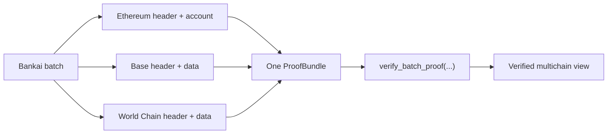

# Basic Bundle Example

This example is the "Bankai in one picture" walkthrough.

The goal is to show that one proof workflow can reach across Ethereum and supported OP Stack chains without changing the trust model.

## Story

Imagine you want to build a live "multichain state postcard":

- on Ethereum, you verify an execution header and an account state
- on Base, you verify an OP header plus some application data
- on World Chain, you verify another OP header tied to a different app flow

The result is simple:

- one verified Ethereum state snapshot
- one verified Base snapshot
- one verified World Chain snapshot
- all anchored to Bankai and verified through the same bundle flow

## Visual Flow



## Illustrative Batch

This is intentionally an onboarding example, so some heights and addresses are placeholders.

```rust
use std::collections::BTreeMap;

use alloy_primitives::Address;
use bankai_sdk::{Bankai, HashingFunction, Network};
use bankai_verify::verify_batch_proof;

#[tokio::main]
async fn main() -> Result<(), Box<dyn std::error::Error>> {
    let mut op_rpcs = BTreeMap::new();
    op_rpcs.insert("base".to_string(), "https://mainnet.base.org".to_string());
    op_rpcs.insert("worldchain".to_string(), "https://YOUR_WORLDCHAIN_RPC".to_string());

    let bankai = Bankai::new(
        Network::Sepolia,
        Some("https://sepolia.infura.io/v3/YOUR_KEY".to_string()),
        Some("https://sepolia.beacon-api.example.com".to_string()),
        Some(op_rpcs),
    );

    let proof_bundle = bankai
        .init_batch(None, HashingFunction::Keccak)
        .await?
        .ethereum_execution_header(9_231_247)
        .ethereum_account(9_231_247, "0x0000006916a87b82333f4245046623b23794c65c".parse::<Address>()?)
        .op_stack_header("base", 38_381_200)
        .op_stack_account("base", 38_381_200, "0xcF93D9de9965B960769aa9B28164D571cBbCE39C".parse::<Address>()?)
        .op_stack_header("worldchain", 12_345_678)
        .op_stack_account("worldchain", 12_345_678, "0x1234567890123456789012345678901234567890".parse::<Address>()?)
        .execute()
        .await?;

    let results = verify_batch_proof(proof_bundle)?;

    println!("Ethereum block {}", results.evm.execution_header[0].number);
    println!("Base block {}", results.op_stack.header[0].number);
    println!("World Chain block {}", results.op_stack.header[1].number);

    Ok(())
}
```

## What This Shows

- Bankai uses one verification flow across chains
- OP Stack chains still enter through the same Bankai anchor
- the SDK can assemble one bundle for multiple independent requests
- the verifier returns one result object grouped by chain family

## Good First Variations

Once you understand this flow, try:

- swapping `op_stack_account(...)` for `op_stack_storage_slot(...)`
- adding `ethereum_receipt(...)` for an Ethereum event flow
- replacing one account proof with a transaction or receipt proof

## Read Next

- [Proof Bundles](https://github.com/bankaixyz/bankai-docs/blob/main/content/docs/sdk/proof-bundles.mdx)
- [Supported Chains](https://github.com/bankaixyz/bankai-docs/blob/main/content/docs/sdk/supported-surfaces.mdx)
- [World ID Root Example](../worldid-root/README.md)
