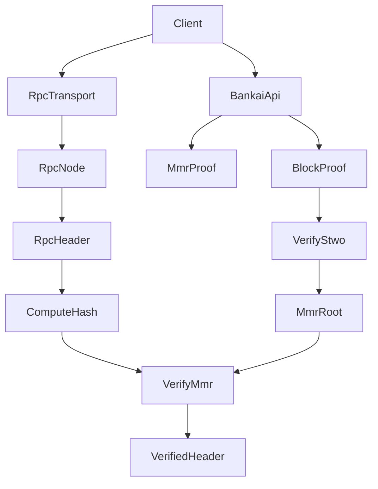

# Verified RPC Example - Implementation Plan

## Summary

This document describes how to implement an example-only crate that fetches
execution-layer headers via JSON-RPC and verifies historical headers using
Bankai MMR proofs. The design isolates transport from verification logic to
remain WASM-friendly.

## Goals

- Provide a `VerifiedRpcClient` that wraps JSON-RPC header retrieval and
  Bankai proof verification for historical execution headers.
- Compute header hashes locally (do not trust RPC-supplied hashes).
- Fetch and verify Bankai STWO block proofs, extract trusted MMR roots, and
  verify MMR inclusion proofs against those roots.
- Include a small demo binary that verifies an `eth_getBlockByNumber` call.
- Document the "latest headers" concept without implementing it.

## Non-Goals

- Implement beacon-chain sync committee signature verification.
- Implement header verification for "latest" (unfinalized) headers.
- Provide a production-ready JSON-RPC client with retries or caching.

## Public API

```rust
VerifiedRpcClient::new(network, rpc_url, bankai_api_base?)
VerifiedRpcClient::get_block_by_number_verified(block_number, bankai_block_number?)
VerifiedRpcClient::get_block_by_hash_verified(hash, bankai_block_number?)
VerifiedRpcClient::call(method, params)
```

### Alloy Provider Wrapper (Drop-in)

Provide `VerifiedProvider` that implements `alloy_provider::Provider` and wraps
an existing Alloy provider instance. This allows existing code to keep using
`Provider` methods while adding `get_block_by_*_verified` helpers.

### Return Types

`get_block_by_*_verified` returns `VerifiedHeader`:

- `header`: the RPC header object
- `header_hash`: computed canonical hash
- `bankai_block_number`: Bankai block used for verification
- `mmr_root`: verified execution MMR root
- `mmr_proof`: MMR inclusion proof metadata

## Data Flow (Historical Headers)



## Component Design

### 1) JSON-RPC Transport

- Define a `JsonRpcTransport` trait that accepts a JSON-RPC request object and
  returns the raw JSON response.
- Provide a `ReqwestTransport` implementation behind the `native` / `wasm`
  feature flags.
- Keep the transport trait generic so WASM targets can supply custom transports.

### 2) VerifiedRpcClient

Responsibilities:

- Build JSON-RPC requests and parse responses.
- Fetch execution headers via `eth_getBlockByNumber` or `eth_getBlockByHash`.
- Compute `header.inner.hash_slow()` to get a canonical header hash.
- Request MMR proof using the computed hash and Bankai block number.
- Fetch and verify the Bankai STWO block proof to obtain trusted MMR roots.
- Verify MMR inclusion using `ExecutionVerifier::verify_header_proof`.

### 3) Bankai API Access

- Default path uses `bankai_sdk::ApiClient` for:
  - `get_latest_block_number`
  - `get_block_proof`
  - `get_mmr_proof`
- Optional `bankai_api_base` uses a thin HTTP client to target non-default
  Bankai endpoints while reusing the same DTO types.

## Proof Verification Flow

1. **Header Retrieval**: fetch the header via JSON-RPC.
2. **Hash Computation**: compute the canonical header hash from fields.
3. **MMR Proof Request**: call Bankai API with computed hash.
4. **STWO Verification**: verify the Bankai block proof to extract trusted
   execution MMR roots.
5. **MMR Verification**: verify the MMR proof against the trusted root.
6. **Return**: assemble `VerifiedHeader` with proof metadata.

## Error Handling

Structured error variants should include:

- RPC transport failures and RPC error responses.
- Missing MMR proof (header not indexed by Bankai).
- STWO verification failures.
- MMR verification failures.
- Header hash mismatch between computed hash and proof hash.

## Hashing and MMR Roots

- Default hashing function: `HashingFunctionDto::Keccak`.
- Execution MMR root selection:
  - Keccak -> `bankai_block.execution.mmr_root_keccak`
  - Poseidon -> `bankai_block.execution.mmr_root_poseidon`

## Latest Headers Concept (Not Implemented)

For "latest" execution headers that are not yet included in a Bankai block:

1. Fetch the latest execution header via JSON-RPC.
2. Use the beacon API to fetch the current sync committee aggregate public key.
3. Validate the header's sync committee signature using BLS.
4. Treat the header as trusted until Bankai catches up, then replace the
   provisional header with a Bankai-verified one.

This design is documented only; it is not part of the example implementation.

## Demo Binary

The example binary should:

- Read `RPC_URL` and `BLOCK_NUMBER` from the environment.
- Optionally accept `BANKAI_BLOCK_NUMBER` and `BANKAI_API_BASE`.
- Call `get_block_by_number_verified` and print the verified hash and MMR root.

## Optional Alloy Integration

Expose a `VerifiedProvider<P>` wrapper that:

- Delegates `Provider` trait methods to an inner Alloy provider.
- Adds `get_block_by_number_verified` and `get_block_by_hash_verified`.
- Uses the same Bankai verification flow as `VerifiedRpcClient`.

## Testing Plan (Lightweight)

- Manual run against Sepolia with a historical block.
- Validate that the computed header hash matches the MMR proof hash.
- Confirm that invalid proofs or mismatched hashes surface structured errors.

## Open Questions

- Should the client expose a configurable hashing function?
- Do we want retry logic or caching for the Bankai API calls?
