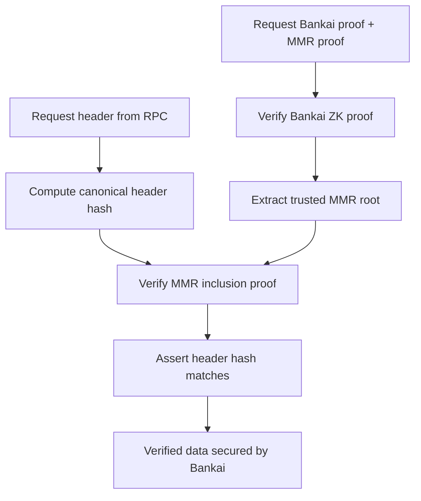

# Verified RPC Example

Bankai is a stateless light client based on recursive ZK proofs. This example
uses Bankai to validate the response of an Ethereum JSON-RPC endpoint by
verifying execution headers against Bankai MMR proofs.

The verified methods are limited right now. The logic wraps an Alloy provider,
so you still get the standard provider surface for unverified calls.

## How it works

1. Request a Bankai block proof and MMR proof from the Bankai API.
2. Request an execution header from RPC.
3. Verify the Bankai ZK proof, extract the trusted MMR root, and run the MMR
   inclusion proof.
4. Assert the RPC header hash matches the MMR proof header hash.
5. Return verified header data secured by Bankai.

### Flow diagram



## Compatible functions

Verified methods:

- `VerifiedRpcClient::get_block_by_number_verified`
- `VerifiedRpcClient::get_block_by_hash_verified`
- `VerifiedProvider::get_block_by_number_verified`
- `VerifiedProvider::get_block_by_hash_verified`

Unverified passthrough:

- `VerifiedRpcClient::call`
- `VerifiedProvider` implements `alloy_provider::Provider`, so all standard
  provider methods remain available without verification.

## Limitations and future work

- Only historical headers are supported today.
- New headers are not yet verified because they are not in the MMR.
- Planned: use the sync committee aggregate key from the Bankai proof to verify
  a header before it is included in the MMR.

## Running the demo (native)

```bash
cargo run -p bankai-example-verified-rpc --features native
```

### Required environment variables

- `RPC_URL`: Execution JSON-RPC endpoint.

Example:

```bash
RPC_URL="https://sepolia.infura.io/v3/YOUR_KEY" \
cargo run -p bankai-example-verified-rpc --features native
```

## Library usage

```no_run
use bankai_example_verified_rpc::VerifiedRpcClient;
use bankai_sdk::Network;

# async fn example() -> Result<(), Box<dyn std::error::Error>> {
let client = VerifiedRpcClient::new(Network::Sepolia, "https://rpc".to_string());
let verified = client.get_block_by_number_verified(5_200_000, None).await?;
println!("Verified header hash: {:?}", verified.header_hash);
# Ok(())
# }
```

## Alloy provider integration (drop-in)

`VerifiedProvider` implements `alloy_provider::Provider`, so it can be used
where a standard Alloy provider is expected while adding verified-header
methods.

```no_run
use alloy_provider::ProviderBuilder;
use bankai_example_verified_rpc::VerifiedProvider;
use bankai_sdk::Network;

# async fn example() -> Result<(), Box<dyn std::error::Error>> {
let provider = ProviderBuilder::new().connect_http("https://rpc".parse()?);
let verified = VerifiedProvider::new(Network::Sepolia, provider);

let latest = verified.get_block_number().await?;
let header = verified
    .get_block_by_number_verified(latest, None)
    .await?;
println!("Verified header hash: {:?}", header.header_hash);
# Ok(())
# }
```

## WASM notes

The core verification flow is transport-agnostic. Build with
`--no-default-features --features wasm` and supply a custom JSON-RPC transport
as needed.

## Contributing

Issues and pull requests are welcome. Keep changes focused on the example crate
and avoid introducing new runtime assumptions.

## License

Licensed under the repository license. See the root `LICENSE` file.
