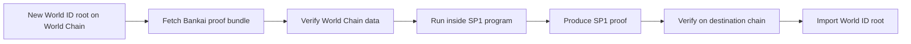

# World ID Replicator

Status: placeholder design document. The implementation is intentionally deferred.

This example describes a future zkVM flow for taking each new World ID root, proving it with Bankai, wrapping that verified result inside SP1, and exporting that proof to another chain.

## The Goal

Bring a World ID root somewhere it does not natively live, while preserving a trust-minimized verification path.

The core idea is:

1. observe a new World ID root on World Chain
2. fetch the Bankai proofs needed to verify the relevant World Chain data
3. verify that data inside a zkVM-oriented flow
4. produce an SP1 proof that another chain can verify
5. use that verified SP1 proof to import the World ID root on the destination chain

## Why This Is Interesting

This is a concrete example of what stateless light clients enable.

Bankai is not just returning data. It is returning the verification path needed to prove that data somewhere else.

## Proposed Flow

## Components

### 1. World Chain input watcher

This component detects a new World ID root or the event/state transition that commits it.

### 2. Bankai proof fetcher

This component requests:

- the OP header proof for the relevant World Chain block
- the account, storage, or receipt proof needed to recover the root

### 3. Bankai verifier step

This step verifies the Bankai bundle and extracts the trusted World ID root.

### 4. SP1 wrapper proof

This step proves that:

- the Bankai verification ran correctly
- the extracted root equals the claimed World ID root being exported

### 5. Destination-chain verifier

This verifies the SP1 proof and accepts the imported World ID root.

## What The Readme Should Eventually Grow Into

When implementation begins later, this example will likely need:

- a runnable Rust workspace example
- an SP1 program
- a host-side script for fetching and proving new roots
- a destination-chain verification example

None of that is included yet in this first docs revamp.

## Non-Goals For This Placeholder

- no runnable code
- no final SP1 program design
- no destination-chain contract implementation
- no exact World ID root source contract/API guarantees documented here

## Why It Belongs In The Docs Already

Even as a placeholder, this example helps readers understand the longer-range Bankai story:

- fetch verified chain data
- carry it into another proving environment
- verify it somewhere else

That is more concrete than a generic zkVM paragraph.

## Read Next

- [Verify Crate Guide](../../docs/verify.md)
- [OP Stack Concepts](../../docs/concepts-op-stack.md)
- [World ID Root Example](../worldid-root/README.md)
